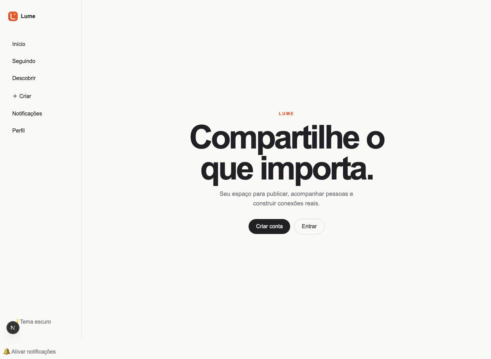
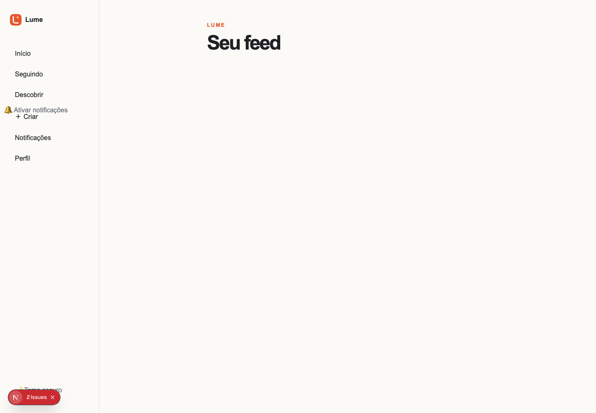
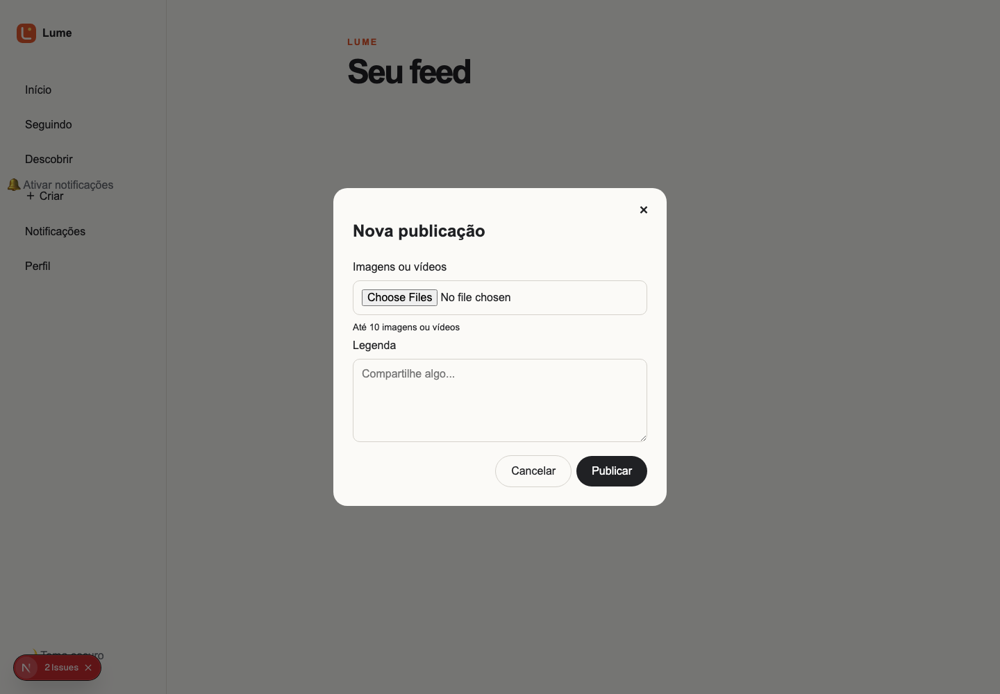
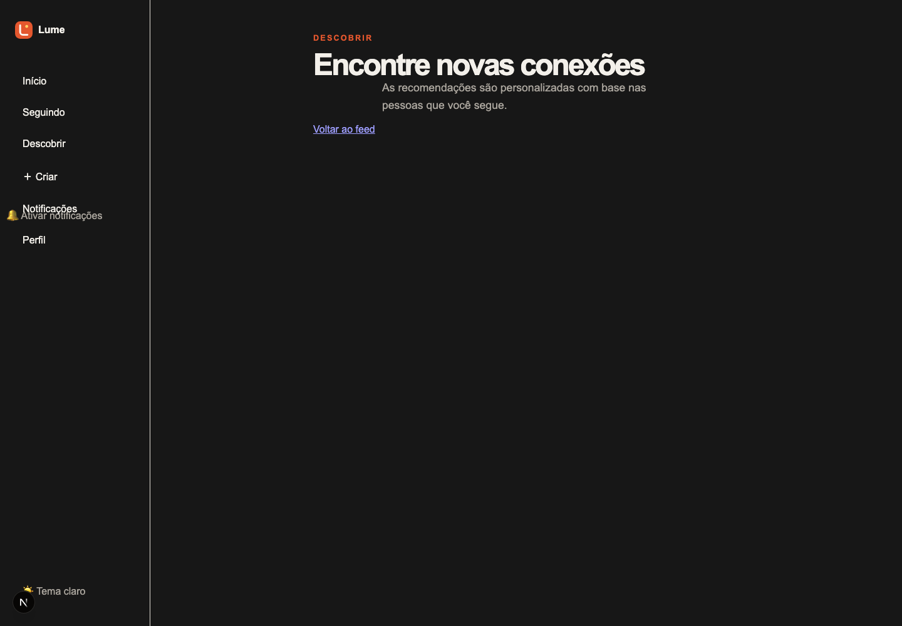
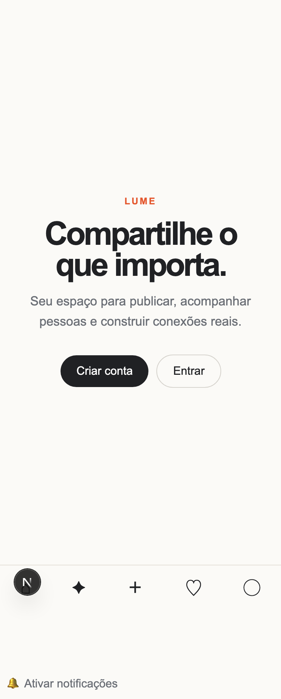
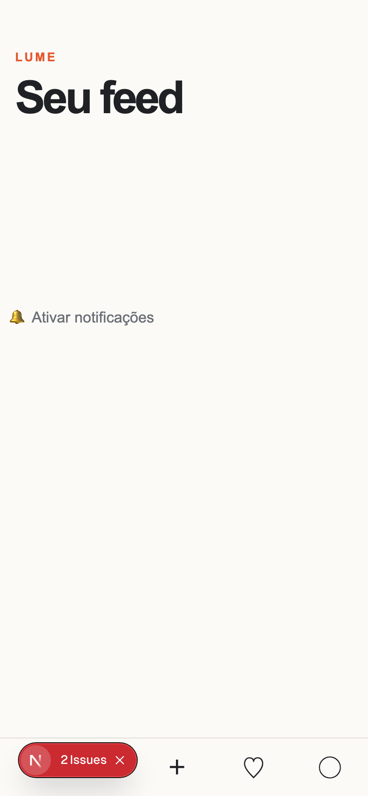

# Social Platform

Monorepo inicial para uma rede social com marca própria.

## Lume


O Lume é uma rede social focada em interesses, descobertas e conexões mais intencionais.

### Prévia da aplicação

| Home desktop                                               | Feed desktop                                               |
| ---------------------------------------------------------- | ---------------------------------------------------------- |
|  |  |

| Modal de criação                                                       | Recomendações                                                          |
| ---------------------------------------------------------------------- | ---------------------------------------------------------------------- |
|  |  |

| Home mobile                                              | Feed mobile                                              |
| -------------------------------------------------------- | -------------------------------------------------------- |
|  |  |

As screenshots são geradas por `bun run screenshots` e ficam em `artifacts/screenshots/`.

### Posts institucionais


## Estrutura

- `apps/web`: interface Next.js com App Router
- `apps/api`: API Bun + Elysia
- `packages/contracts`: tipos compartilhados entre web e API
- `packages/database`: configuração inicial para PostgreSQL + Drizzle
- `packages/ui`: tokens e componentes compartilháveis

## Desenvolvimento

Requisitos: Bun, Docker e Docker Compose.

```bash
cp .env.example .env
bun install
bun run db:up
bun run dev
```

A interface fica em `http://localhost:3000`, a API em `http://localhost:3001` e o health check em `/health`.

### Ambientes

As variáveis são separadas por ambiente:

- `.env.development.example`: serviços locais, Docker e valores seguros de desenvolvimento.
- `.env.production.example`: template para secrets do ambiente de produção; nunca commite o arquivo preenchido.

Para desenvolvimento, copie `.env.development.example` para `.env`. Em produção, injete as variáveis pelo provedor de deploy ou copie o template para `.env.production` fora do controle de versão. Os arquivos `.env` reais estão no `.gitignore`.

## Próximos passos do MVP

### Hardening implementado

- [x] Schemas TypeBox reutilizáveis para corpos, parâmetros e queries; casts de entrada removidos da API.
- [x] Validação de UUIDs, URLs, MIME, limites, enums e cursores.
- [x] Erros com formato `{ code, message, details, requestId }`, sem stack trace para o cliente.
- [x] Logs JSON com requestId, status e duração.
- [x] Transações no cadastro, criação de conversas, posts e moderação.
- [x] Constraints PostgreSQL para papéis, follows, blocks, denúncias, mídias e notificações.
- [x] Teste de rollback com PostgreSQL e execução de migrações no CI.
- [x] WebSocket autenticado no upgrade e autorizado por conversa.

O teste de integração PostgreSQL roda com `bun run test:integration` quando `DATABASE_URL` estiver definido. O CI inicia PostgreSQL, executa as migrações reais e então roda a suíte.

As migrações `0011` e `0012` mantêm correções redundantes da constraint de denúncias para preservar compatibilidade com ambientes que possam ter aplicado versões anteriores. Não remova nem renumere essas migrações sem confirmar o histórico de execução dos bancos compartilhados.

1. Modelar usuários, perfis e sessões no pacote de banco.
2. Implementar autenticação com cookie HttpOnly.
3. Criar endpoints de perfil, seguir e feed cronológico.
4. Adicionar migrações, upload de imagens e testes de permissões.

## Checklist do projeto

### 1. Planejamento e rebrand

- [x] Definir o nome da plataforma: **Lume** (nome provisório, sujeito a validação jurídica e de marca).
- [x] Criar logotipo próprio em `apps/web/public/logo.svg`.
- [x] Escolher cores, fontes e estilo dos ícones.
- [x] Definir público-alvo e diferencial.
- [x] Produzir wireframes para desktop e celular em `docs/wireframes.md`.
- [x] Não reutilizar nome, logotipo ou ativos oficiais do Instagram.
- [x] Criar rascunhos de termos de uso e política de privacidade.

Identidade inicial: o Lume é voltado a pessoas que querem compartilhar interesses e momentos com mais intenção, priorizando conexões por afinidade e um feed cronológico. A paleta usa terracota (`#e4572e`), creme (`#fbfaf7`) e amarelo-luz (`#ffd166`), com tipografia sans-serif limpa e ícones lineares arredondados.

Os documentos legais estão em `docs/legal/` e precisam de revisão jurídica antes de produção.

### 2. Configuração técnica

- [x] Criar monorepo com Bun Workspaces.
- [x] Criar aplicação Next.js com App Router.
- [x] Criar API com Bun + Elysia.
- [x] Configurar TypeScript em modo estrito.
- [x] Configurar ESLint, Prettier e hooks de Git.
- [x] Separar variáveis de desenvolvimento e produção.
- [x] Configurar Docker para banco e serviços locais.

Arquitetura recomendada:

```text
Next.js App Router
├── Interface e páginas
├── Server Components
└── Autenticação no cliente
        ↓
Bun + Elysia
├── API REST
├── Regras de negócio
├── Uploads
├── Feed
└── Notificações
        ↓
PostgreSQL + armazenamento de mídia
```

Estrutura do monorepo:

```text
social-platform/
├── apps/
│   ├── web/          # Next.js
│   └── api/          # Elysia
├── packages/
│   ├── database/
│   ├── contracts/
│   ├── ui/
│   └── config/
├── docker-compose.yml
└── package.json
```

O Next.js também pode integrar o Elysia diretamente nas rotas do App Router. Para este projeto, a API permanece separada para facilitar a escalabilidade e o processamento futuro de vídeos.

### 3. Banco de dados

- [x] PostgreSQL via Docker Compose.
- [x] Drizzle ORM.
- [x] Migração inicial e seed de desenvolvimento.
- [x] Redis via Docker Compose para cache, sessões e filas.
- [x] Índices para feed, busca e notificações.
- [x] Exclusão lógica (`deleted_at`) e auditoria (`audit_logs`).

Tabelas principais:

```text
users, profiles, sessions, posts, post_media, comments, likes,
follows, saved_posts, stories, story_views, conversations,
conversation_members, messages, notifications, reports, blocks
```

### 4. Autenticação e segurança

- [x] Cadastro por e-mail.
- [x] Login e logout.
- [x] Verificação de e-mail por token com expiração.
- [x] Recuperação de senha por token com expiração.
- [ ] OAuth com Google ou Apple.
- [x] Sessão em cookie HttpOnly, Secure e SameSite.
- [x] Senhas com Argon2id via Bun.
- [x] Controle de acesso por usuário.
- [x] Rate limiting inicial por IP.
- [x] Validação de arquivos enviados: tamanho, MIME, assinatura, dimensões e sanitização EXIF.
- [x] Proteção inicial contra XSS, CSRF e abuso: validação de payloads, SameSite e rate limiting.
- [x] CORS restrito ao domínio do front-end.
- [x] Bloqueio e desbloqueio de usuários.
- [x] Denúncia de usuários e publicações.
- [x] Moderação administrativa com fila, status e remoção lógica.

Endpoints de moderação: `GET /api/v1/moderation/reports?status=open` e `PATCH /api/v1/moderation/reports/:reportId`. Apenas usuários com `role=admin` podem acessar a fila.

Endpoints implementados: `POST /api/v1/auth/register`, `POST /api/v1/auth/login`, `POST /api/v1/auth/logout`, `GET /api/v1/auth/me`, `POST /api/v1/auth/verify-email`, `POST /api/v1/auth/request-password-reset` e `POST /api/v1/auth/reset-password`.

O Elysia possui plugins oficiais para JWT e CORS. Tokens sensíveis não devem ser salvos no `localStorage`.

Upload autenticado: `POST /api/v1/uploads` com `multipart/form-data` e campo `file`. Imagens são normalizadas para WebP sem metadados EXIF; imagens têm limite de 10 MB e vídeos de 100 MB.

### Banco local

```bash
bun run db:up
bun run db:migrate
bun run db:seed
bun run db:seed:institutional
```

O schema fica em `packages/database/src/schema.ts`, as migrações em `packages/database/drizzle/` e o cliente Redis em `packages/database/src/redis.ts`.

O comando `bun run db:seed:institutional` cria três posts de apresentação do Lume para demonstração do feed. Ele usa o perfil `demo` e não duplica publicações já existentes.

### 5. Perfis sociais

- [x] Foto e nome do usuário.
- [x] Identificador `@username` único.
- [x] Biografia e links.
- [x] Perfil público ou privado.
- [x] Contagem de publicações, seguidores e seguindo.
- [x] Seguir, deixar de seguir e solicitar acesso.
- [x] Bloquear e denunciar usuário.
- [x] Página de edição do perfil via API.

Endpoints implementados: `GET /api/v1/profiles/:username`, `PATCH /api/v1/profiles/me`, `POST/DELETE /api/v1/profiles/:userId/follow`, `POST /api/v1/profiles/:userId/block` e `POST /api/v1/profiles/:userId/report`.

### 6. Publicações

- [x] Criar post com foto.
- [x] Criar carrossel.
- [x] Publicar vídeo por mídia validada.
- [x] Legenda, localização e marcações.
- [x] Curtir e remover curtida.
- [x] Comentar e responder.
- [x] Salvar publicação.
- [x] Compartilhar link.
- [x] Editar legenda.
- [x] Excluir publicação com exclusão lógica.
- [x] Gerar miniaturas e diferentes resoluções via worker de mídia.

Endpoints implementados: `POST /api/v1/posts`, `GET /api/v1/posts/:postId`, `PATCH/DELETE /api/v1/posts/:postId`, `POST/DELETE /api/v1/posts/:postId/like`, `POST/GET /api/v1/posts/:postId/comments`, `POST/DELETE /api/v1/posts/:postId/save` e `GET /api/v1/posts/:postId/share`. O worker gera thumbnail, WebP `sm` (640px), `md` (1080px) e `lg` (2048px) para imagens.

### 7. Feed

- [x] Feed cronológico inicial.
- [x] Paginação por cursor.
- [x] Carregamento infinito.
- [x] Atualização otimista de curtidas com rollback em caso de erro.
- [x] Skeleton durante carregamento.
- [x] Pré-carregamento das próximas imagens via `rootMargin`.
- [x] Feed “seguindo” via `?following=true`.
- [x] Ocultar publicações denunciadas ou bloqueadas.
- [x] Recomendações iniciais por rede social.

O endpoint `GET /api/v1/recommendations/users` recomenda perfis com base em conexões de segundo grau e possui fallback para descoberta. A interface inicial está disponível em `/recommendations`; o algoritmo poderá evoluir com dados reais de uso.

O endpoint `GET /api/v1/feed` aceita `limit`, `cursor` e `following=true`. A interface está disponível em `/feed`.

Começar pelo feed cronológico. O algoritmo de recomendação pode ser adicionado depois que houver dados reais de uso.

### 8. Stories e vídeos curtos — segunda fase

- [x] Stories com validade de 24 horas.
- [x] Registro de visualizações únicas.
- [ ] Barra de progresso na interface.
- [x] Vídeos verticais validados na API.
- [x] Controles de reprodução na interface.
- [x] Transcodificação com FFmpeg em produção via `media-worker`.
- [x] Geração de thumbnail em produção via `media-worker`.
- [x] Entrega configurável por CDN via `MEDIA_CDN_URL`.
- [x] Fila assíncrona Redis para processamento.

Endpoints implementados: `POST /api/v1/stories`, `GET /api/v1/stories` e `POST /api/v1/stories/:storyId/view`. O worker pode ser iniciado com `bun run media:worker` ou pelo serviço `media-worker` do Docker; ele requer jobs com `inputPath`, `outputPath` e `thumbnailPath` na fila Redis `media:processing`.

### 9. Mensagens e notificações — segunda fase

- [x] Conversas individuais.
- [x] Envio de texto e mídia.
- [x] Indicador de mensagem lida.
- [x] WebSocket para tempo real.
- [x] Notificações automáticas de curtida, comentário e seguidores.
- [x] Push notifications via Web Push/VAPID.
- [x] Preferências de notificação.
- [x] Proteção contra spam inicial por usuário.

Endpoints implementados: `POST /api/v1/conversations`, `GET /api/v1/conversations`, `GET/POST /api/v1/conversations/:conversationId/messages`, `POST /api/v1/conversations/:conversationId/read`, `GET /api/v1/notifications`, `POST /api/v1/notifications/:notificationId/read` e `GET/PATCH /api/v1/notification-preferences`. O WebSocket nativo do Bun usa `ws://localhost:3002` (configurável por `WS_PORT`).

Push notifications exigem preencher `VAPID_SUBJECT`, `VAPID_PUBLIC_KEY` e `VAPID_PRIVATE_KEY`. O usuário pode ativá-las pelo botão na barra lateral; o service worker fica em `apps/web/public/sw.js`.

### 10. Interface Next.js

- [x] Layout responsivo.
- [x] Navegação inferior no celular.
- [x] Barra lateral no desktop.
- [x] Tema claro e escuro.
- [x] Modal de criação de publicação.
- [x] Componentes acessíveis.
- [x] Atalhos de teclado (`Ctrl/Cmd + N`).
- [x] Metadados e Open Graph básico.
- [x] Imagens com `next/image`.
- [x] Server Components sempre que possível.
- [x] Client Components somente para interação.

### 11. Upload e infraestrutura

- [x] Upload direto para S3, R2 ou serviço equivalente.
- [x] URLs assinadas com validade de 15 minutos.
- [x] CDN para imagens e vídeos via `MEDIA_CDN_URL`.
- [x] Limite de tamanho e formato.
- [x] Remoção de metadados EXIF sensíveis.
- [x] Compressão de imagens.
- [x] Transcodificação assíncrona.
- [x] Backup do PostgreSQL via `scripts/backup-db.sh`.
- [x] Logs básicos e health check da API.
- [x] Ambientes de desenvolvimento, homologação e produção documentados.

Para upload direto, use `POST /api/v1/uploads/presign` com `filename`, `contentType` e `size`, envie o arquivo com `PUT` para `uploadUrl` e use `publicUrl` no post. O modal em `/feed` permite selecionar até 10 imagens ou vídeos e usa `POST /api/v1/uploads` no ambiente local. Configure credenciais S3/R2 apenas no ambiente da API.

### 12. Testes

- [x] Testes unitários com `bun test`.
- [x] Testes da API.
- [x] Testes de permissões.
- [x] Testes E2E com Playwright.
- [x] Testes de upload.
- [x] Teste de carga do feed.
- [ ] Verificação em celular real.
- [x] Auditoria inicial de acessibilidade com Playwright.
- [x] Teste contra spam e múltiplas requisições.

Comandos de validação: `bun run test`, `bun run test:e2e` e `bun run test:load`. A suíte inclui matriz de privacidade/autorização e paginação de carrosséis. O teste de carga aceita `LOAD_TEST_URL` e `LOAD_TEST_REQUESTS`; execute-o apenas contra ambientes controlados.

Para capturar o fluxo completo da aplicação, inicie o frontend e execute `bun run screenshots`. As imagens são salvas em `artifacts/screenshots/`. É possível alterar a origem com `SCREENSHOT_BASE_URL=https://staging.example.com bun run screenshots`.

### 13. Ordem do MVP

- [x] Cadastro e autenticação.
- [x] Perfil do usuário.
- [x] Seguir usuários.
- [x] Publicar imagens.
- [x] Feed cronológico.
- [x] Curtidas e comentários.
- [x] Salvar posts.
- [x] Busca de usuários.
- [x] Notificações.
- [x] Denúncia e bloqueio.

Endpoint de busca: `GET /api/v1/users/search?q=termo` (autenticado, máximo de 20 resultados).

Stories, vídeos curtos, chat e algoritmo de recomendação ficam para a segunda fase. Esse MVP permite lançar e validar a plataforma sem tentar reconstruir todos os recursos do Instagram de uma vez.
